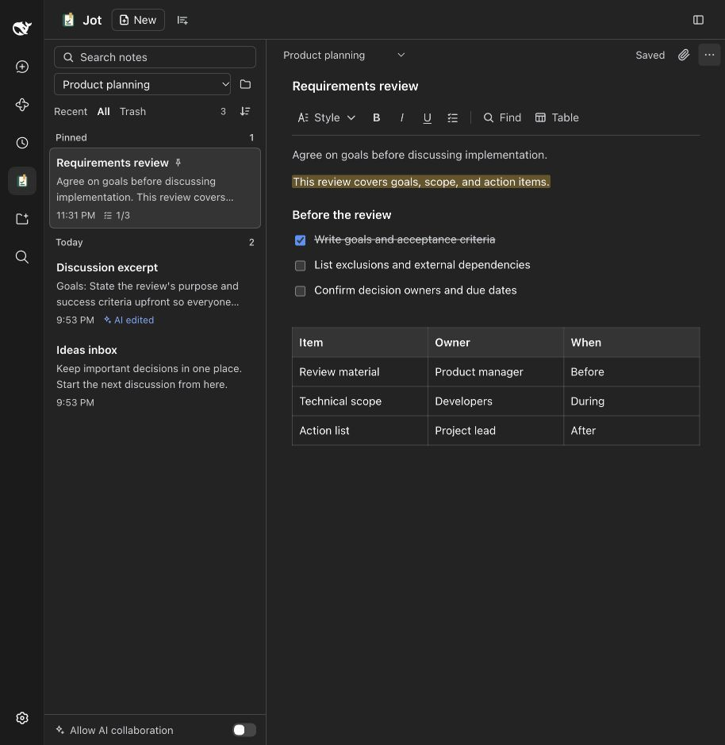
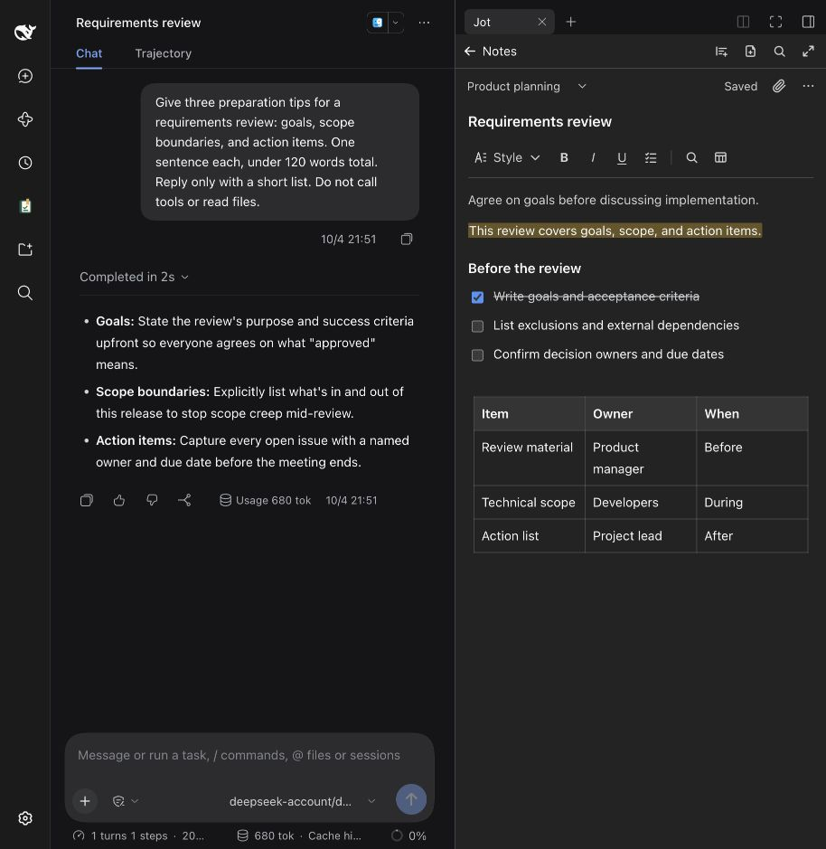

<p align="center">
  
</p>

<h1 align="center">Jot · 随记</h1>

<p align="center"><strong>A notebook beside your conversations.</strong><br>Jot down ideas, to-dos and light documents that stay yours, and ask AI to help only when you want it to.</p>

<p align="center">
  <a href="https://www.npmjs.com/package/dsh-jot"></a>
  
  <a href="./LICENSE"></a>
</p>

<p align="center">
  <a href="#install">Install</a> · <a href="./docs/GUIDE.en.md">Guide</a> · <a href="./CHANGELOG.md">Changelog</a> · <a href="./README.md">中文</a>
</p>



> **New in 0.2.7:** import Markdown files, whole folders or a ZIP exported from Jot; when AI changes a few words it changes only those words, keeping formatting; text AI adds to the end while you are writing joins your draft when it can be merged safely. Released changes are in the [changelog](./CHANGELOG.md).

## Why Jot

| Right beside the conversation | You write, AI helps | Your data stays yours |
| --- | --- | --- |
| Open the full workbench from the left navigation, or write in the right sidebar while you chat. `/jot` finds a note from the composer. | AI collaboration starts off. When on, AI reads or edits only when you ask and keeps your formatting; changed notes are labelled **AI edited** and can be reverted when an earlier version exists. | Notes live in your local DSH data folder with no cloud sync. Export everything to Word, PDF or Markdown, and import the ZIP back exactly. |

## Install

```sh
# Desktop
dsh plugin --profile desktop add dsh-jot

# DSH Web UI
dsh plugin --profile web add dsh-jot
```

Restart DSH and **Jot** appears in the left navigation; press **New** to start writing. Desktop and Web are installed separately. The official Desktop can enable its bundled CLI through the application menu's “Manage dsh command…”; the CLI requires Node.js `^22.19.0 || >=24`.

**Upgrade:** `dsh plugin --profile desktop add dsh-jot@latest`, then restart. **Uninstall:** `dsh plugin --profile desktop remove dsh-jot`; your notes are kept. Use `web` instead of `desktop` for the Web UI.

## What it does

**Writing that stays out of the way**

- Write like an ordinary document: headings, lists, checkable to-dos, quotes, code, tables, text colors and highlights. No Markdown required.
- Type `/` on an empty line for an insert menu (Chinese input methods can use `、`). Typing `# `, `- ` or `[ ] ` also formats as you go.
- Tables support row and column editing and draggable widths; checklist items can be ticked and reordered from the keyboard.

**Find it again**

- Search titles and body text, with title matches first and the matching sentence shown; find and replace inside a note.
- Pins, recent edits, optional folders, sorting and multi-select. The list shows checklist progress such as `2/5`.

**Collect as you go**

- Capture selected text into a new or the current note; paste screenshots or drop files, previewed in DSH's official viewers for Word, spreadsheets, PDF and images.
- Move in from a Markdown vault such as Obsidian: import Markdown or TXT files or a whole folder. Subfolders become Jot folders, and the images and files the notes use come along.

**Nothing gets lost**

- Autosave and recovery drafts. Safe additions from elsewhere join your draft once; divergent or uncertain additions keep your writing aside for you to choose. Deleting notes, one or many at a time, can be undone; permanent deletion asks first.
- Export a note to Word, PDF, Markdown or TXT, or package every note or one folder into a single ZIP with PNG/JPEG images embedded in Word and PDF. The ZIP carries the complete notes, so **Import notes** restores it exactly; it doubles as a backup.



## Working with AI

Turn on **Allow AI collaboration** at the bottom of the list, then tell the AI which note to read or update, for example:

> Add the three decisions we just agreed on to my Jot note *Weekly sync*.
>
> Tick item 2 in *Follow-ups*.

- AI can search, read, create and append to notes, replace specific text, tick a single to-do, or move a note to Trash. Every call checks the switch, and AI cannot turn it on.
- AI reads notes as formatted Markdown. Changing a few words replaces only those words, keeping headings, lists, bold, links and colors; rewriting a whole note is allowed only when its formatting survives, and AI asks you first about what cannot, such as table column widths.
- Notes changed by AI are labelled **AI edited**. When an existing note has a version from before AI edits, select the label to restore it; consecutive AI edits are undone together. Notes created by AI show the label without this undo action.
- Notes are never added to each conversation turn automatically; AI reads them only through its tools, and with AI collaboration off, Jot's tools are not offered to the conversation at all.

See the [guide](./docs/GUIDE.en.md#working-with-an-agent) for the tools and the Markdown they accept.

## Keyboard shortcuts

Press `?` inside Jot to see every shortcut. The common ones:

| Action | macOS | Windows / Linux |
| --- | --- | --- |
| Bold / italic / underline | ⌘B / ⌘I / ⌘U | Ctrl+B / I / U |
| Heading 1–3 | ⌥⌘1–3 | Ctrl+Alt+1–3 |
| To-do list / check this to-do | ⇧⌘9 / ⌘↩ | Ctrl+Shift+9 / Ctrl+Enter |
| Move list item up / down | ⌥⇧↑ / ⌥⇧↓ | Alt+Shift+↑ / ↓ |
| Find in note / save now | ⌘F / ⌘S | Ctrl+F / Ctrl+S |
| Search all notes | `/` (outside a text field) | same |

“Open Jot”, “New note” and “Capture selected text” have no default keys. Search for “Jot” in DSH's keyboard shortcut settings to bind them.

## FAQ

**How is this different from asking AI to “remember”?** Jot's notes are documents you can see, edit and export. They are never silently rewritten or injected into each turn; AI reads or writes them only when the switch is on and you ask.

**Will uninstalling or upgrading lose notes?** No. Notes live in the DSH data folder, separate from the plugin package, and older versions can still read notes saved by newer ones.

**Where are notes stored, and how do I back them up?** In `$DSH_HOME/jot` (`~/.dsh/jot` when unset); back up the whole folder, or use **Export all notes** for one ZIP that **Import notes** restores exactly. Desktop and Web share notes when they use the same data folder. Attachments default to 20 MiB each and 500 MiB in total.

**Can I move in from Obsidian or other Markdown notes?** Yes. Choose **Import notes** under **Sort and options** in the list, then pick the whole vault folder. Titles come from a leading level-1 heading or the file name, images and files come along, and notes identical to ones already in Jot are skipped, so importing twice adds nothing.

**Why does an action mention “kept drafts”?** Another panel has unsaved changes to that note, and the two sides cannot be merged safely. Open it and load the latest version or save the draft as a new note first, so neither side's writing is lost.

## Compatibility

Works with DSH 0.2.0-rc.2 (official macOS Desktop) and 0.2.1-alpha.1 (Web). Windows and Linux pass CI source checks, but the UI and shortcuts have not been tested on actual systems; each release's actual checks are in the [validation record](./docs/VALIDATION.md). Cloud sync, real-time collaboration, version history and drawing are not included.

See [the proposed OMDSH author declaration](./docs/community/omdsh-intake.md) for intake metadata around the existing Profile Bundle. This is not market approval or installation authority; the repository, runtime and compatibility range remain unchanged.

## More

- [Guide](./docs/GUIDE.en.md): importing, attachment and export limits, AI tool details, backups and conflicts.
- [Product scope](./PRODUCT.md): product decisions, implemented features and future directions.
- [GitHub Releases](https://github.com/Totoro-qaq/dsh-jot/releases) · [npm](https://www.npmjs.com/package/dsh-jot) · [Report an issue](https://github.com/Totoro-qaq/dsh-jot/issues)

<details>
<summary>Build from source</summary>

Use Node.js `^22.19.0 || >=24` and pnpm 11:

```sh
git clone https://github.com/Totoro-qaq/dsh-jot.git
cd dsh-jot
pnpm install --frozen-lockfile
pnpm check            # typecheck, tests and build
pnpm dev              # local preview: http://127.0.0.1:4178
pnpm pack --pack-destination artifacts
dsh plugin --profile desktop add "$PWD/artifacts/dsh-jot-<version>.tgz"
```

Use `--profile web` for the Web UI. After changing `src/client/icons.tsx`, run `pnpm icons` to update `assets/icons`.

</details>

[MIT](./LICENSE) · Embedded PDF fonts use the [SIL Open Font License](./assets/fonts/OFL.txt).
