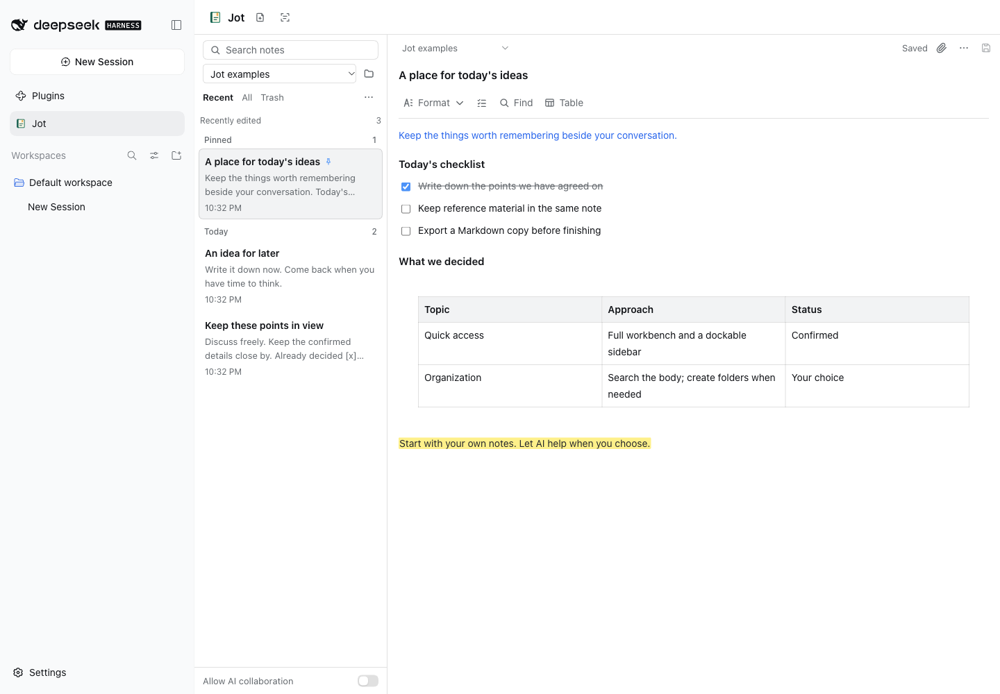
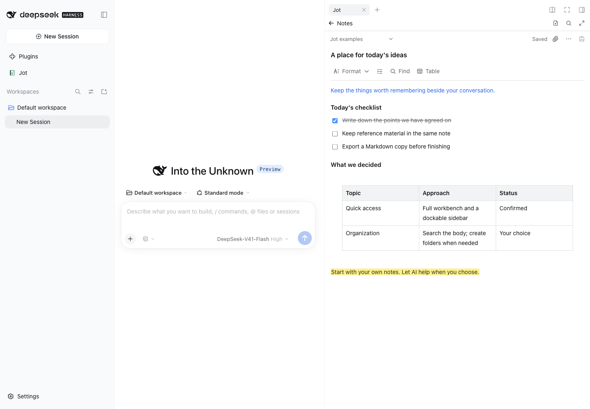

<p align="center">
  
</p>

<h1 align="center">Jot · 随记</h1>

<p align="center">Human-owned notes, to-dos and lightweight documents inside DSH, with optional agent collaboration.</p>

<p align="center">
  <a href="./README.md">中文</a> · English · <a href="./docs/GUIDE.zh-CN.md">Guide (Chinese)</a> · <a href="./docs/VALIDATION.md">Validation</a> · <a href="./LICENSE">MIT</a>
</p>

**0.2.4** · Validated with **DeepSeek Harness 0.2.0-rc.2** · [Releases](https://github.com/Totoro-qaq/dsh-jot/releases)



*Browse and organize in the full workbench; write beside a conversation in the right sidebar. Screenshots show English example notes in the actual Host's English interface. Folder names are chosen by the user.*

## Start with a thought

- **Write directly.** Headings, bold, italic, underline, checklists, tables, text colors and highlights, without writing Markdown syntax. Tables support row/column menus, end-of-table insertion, draggable column widths, and automatic width fitting.
- **Find and organize.** Search note titles and body text, find and replace within a note, pin frequently used notes, view recent edits, organize with optional folders, and sort, select, move, or duplicate notes.
- **Keep material.** Capture text and attach images or files. Attachments use DSH's official viewers for Word/PowerPoint, spreadsheets, images, PDF and text; a Host with a desktop can also open them in the default application.
- **Keep writing.** Autosave, local recovery drafts, and revision-conflict notices help you keep writing; deleted notes go to Trash.
- **Export your work.** Export to Markdown, TXT, PDF, or Word (DOCX); Markdown with attachments exports as a self-contained offline ZIP archive.

A colorful notebook identifies Jot. Actions use consistent icons; fonts, text scaling and themes follow DSH.

## Install and write your first note

Install into the profile you use:

```sh
# Desktop
dsh plugin --profile desktop add dsh-jot

# DSH Web UI
dsh plugin --profile web add dsh-jot
```

Restart the corresponding Host after installation. Desktop and Web installations are independent. The official Desktop can enable its bundled CLI through the application menu's “Manage dsh command…” entry. DSH 0.2.0-rc.2 is the validated version; the CLI requires Node.js `^22.19.0 || >=24`.

1. Choose **Jot** in the left navigation and create a note. The full workbench needs no conversation.
2. With a conversation selected, choose **Jot** in the right sidebar's new-tab guide to write beside it.
3. To ask an agent for help, enable **Allow AI collaboration**, then explicitly ask it to read or maintain a note.

## A place for notes beside the conversation



DSH manages the sidebar's tabs, floating and docking. Expand into the full workbench to continue writing. Jot uses its own entries and scoped styles, following the Host's fonts and theme.

**AI collaboration starts OFF.** When enabled, Jot's explicit tools can search, read, create, update or move notes to Trash; every call checks the current switch. You control note editing and AI access. Notes are not automatically injected into each conversation or summarized.

## Quick shortcuts

| Action | macOS | Windows / Linux |
| --- | --- | --- |
| Copy / cut / paste / select all | Cmd+C / X / V / A | Ctrl+C / X / V / A |
| Undo / redo | Cmd+Z / Shift+Cmd+Z | Ctrl+Z / Ctrl+Shift+Z; also Ctrl+Y |
| Bold / italic / underline | Cmd+B / I / U | Ctrl+B / I / U |
| Find current note / save | Cmd+F / S | Ctrl+F / S |

## Local data and current scope

Data stays in `$DSH_HOME/jot`, or `~/.dsh/jot` when unset. Back up the whole directory; recovery drafts also live in the interface's Local Storage. Human and agent edits check revisions to avoid silent overwrites, and the user controls the AI permission switch.

Attachments default to 20 MiB per file and 500 MiB total. Official previews require a selected conversation and the corresponding viewer; opening from the full workbench returns to that conversation. Without one, image/PDF dialogs and downloads remain available. Default application opening uses a copy on the DSH Host; save external edits separately and reattach them. Cloud sync, real-time collaboration, drawing and version history are not included; exports do not promise pixel-identical editor output.

Version 0.2.4 adds official attachment previews and application opening, and passed local typecheck, 197 tests, build and package checks. Actual DSH Web UI checks covered Word, CSV, PDF and TXT; default application opening was observed in macOS TextEdit. CI is configured for Linux, macOS and Windows; see the [validation record](./docs/VALIDATION.md) for results and historical Desktop checks. Windows/Linux application opening has **not been tested on actual systems**. Complete native IME/clipboard behavior, long-term stability and specific third-party plugin combinations still need further validation.

## More

- [GitHub Releases](https://github.com/Totoro-qaq/dsh-jot/releases) · [npm package](https://www.npmjs.com/package/dsh-jot) · [Report an issue](https://github.com/Totoro-qaq/dsh-jot/issues)
- [User guide (Chinese)](./docs/GUIDE.zh-CN.md): AI tools, attachment/export limits, backups, conflicts and development preview.
- [Product scope](./PRODUCT.md): implemented features, product decisions and future candidates.
- [Validation record](./docs/VALIDATION.md): actual Host, shortcut and plugin-coexistence test scope.

<details>
<summary>Build from source</summary>

Use Node.js `^22.19.0 || >=24` and pnpm 11:

```sh
git clone https://github.com/Totoro-qaq/dsh-jot.git
cd dsh-jot
pnpm install --frozen-lockfile
pnpm check
pnpm pack:check
pnpm pack --pack-destination artifacts
dsh plugin --profile desktop add /absolute/path/to/dsh-jot/artifacts/dsh-jot-0.2.4.tgz
```

Replace the final path with the actual file path. For Web, use `--profile web`.

</details>

[MIT](./LICENSE) · Embedded PDF fonts use the [SIL Open Font License](./assets/fonts/OFL.txt).
