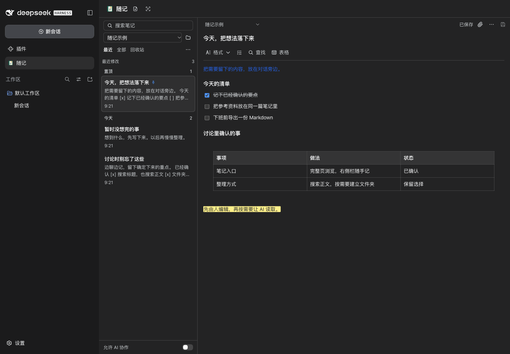
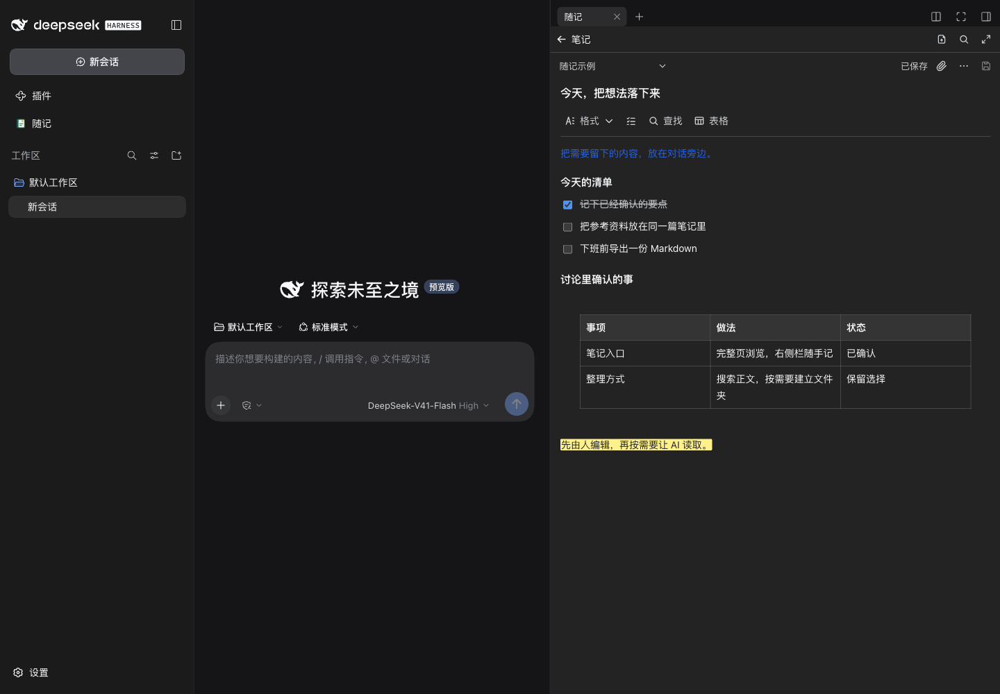

<p align="center">
  
</p>

<h1 align="center">随记 / Jot</h1>

<p align="center">在 DSH 里直接写笔记、待办和轻文档，按需要让 agent 一起维护。</p>

<p align="center">
  中文 · <a href="./README.en.md">English</a> · <a href="./docs/GUIDE.zh-CN.md">使用指南</a> · <a href="./docs/VALIDATION.md">验证记录</a> · <a href="./LICENSE">MIT</a>
</p>

**0.2.3** · 验证宿主 **DeepSeek Harness 0.2.0-rc.2** · [更新记录](https://github.com/Totoro-qaq/dsh-jot/releases)



*完整页用来浏览和整理，右侧栏用来边聊边记。截图为真实宿主中的示例笔记；文件夹名称由用户自行决定。*

## 从一句想法开始

- **直接写。** 段落、标题、粗体、斜体、下划线、核对清单、表格、文字颜色和高亮，不要求输入 Markdown。表格支持行列菜单、末尾「＋」、列宽拖动和自动适应。
- **随手找。** 搜索标题和正文，在笔记内查找与替换，置顶常用笔记，查看最近修改；文件夹按需创建，也可以排序、多选、移动和复制。
- **把资料留下。** 摘录选中或粘贴的文字，添加图片与文件；图片可预览，PDF 使用宿主查看器，其他附件可下载。
- **安心接着写。** 自动保存，保留恢复草稿，提示版本冲突；删除的笔记进入回收站。
- **带到别处。** 导出 Markdown、TXT、PDF 或 Word（DOCX）；带附件的 Markdown 打包为可离线使用的 ZIP。

彩色笔记本是随记的入口；操作图标保持统一，字体、字号缩放与主题跟随 DSH。

## 安装并写下第一条笔记

**发布状态：** GitHub Release `0.2.3` 已提供预构建安装包，npm 当前公开版本为 `0.2.2`；`0.2.3` 的 npm 发布仍待账号安全密钥验证。建议先用修复版 Release：

```sh
# 桌面客户端；Web 将 desktop 换成 web
dsh plugin --profile desktop add https://github.com/Totoro-qaq/dsh-jot/releases/latest/download/dsh-jot.tgz
```

npm 0.2.3 完成发布后，可安装到需要使用的 Profile：

```sh
# 桌面客户端
dsh plugin --profile desktop add dsh-jot

# DSH Web UI
dsh plugin --profile web add dsh-jot
```

安装后重启对应 Host。Desktop 和 Web 的插件安装相互独立；官方桌面应用菜单「管理 dsh 命令…」可启用内置 CLI。当前验证版本为 DSH 0.2.0-rc.2；CLI 的 Node.js 要求为 `^22.19.0 || >=24`。

1. 点击左侧「随记」，新建笔记。完整工作台不需要先选会话。
2. 选中会话后，在右侧栏的新标签页指引中打开「随记」，把重点记在对话旁边。
3. 想请 AI 帮忙时，打开「允许 AI 协作」，再明确告诉它读取或维护哪篇笔记。

## 对话旁边，留一点地方给笔记



右侧栏的标签页、浮出和停靠由 DSH 管理；可以放大到完整页继续编辑。随记使用独立入口和局部样式，字体与主题跟随宿主。

**AI 协作默认关闭。** 开启后，agent 可以搜索、读取、创建、修改笔记或将其移到回收站；每次调用都检查最新开关。笔记由人控制，也不会自动注入每轮对话或自动生成总结。

## 常用快捷键

| 操作 | macOS | Windows / Linux |
| --- | --- | --- |
| 复制／剪切／粘贴／全选 | ⌘C / X / V / A | Ctrl+C / X / V / A |
| 撤销／重做 | ⌘Z / ⇧⌘Z | Ctrl+Z / Ctrl+Shift+Z，另支持 Ctrl+Y |
| 粗体／斜体／下划线 | ⌘B / I / U | Ctrl+B / I / U |
| 当前笔记查找／保存 | ⌘F / S | Ctrl+F / S |

## 数据与当前范围

数据保存在本地 `$DSH_HOME/jot`，未设置时为 `~/.dsh/jot`。备份时保留整个目录；界面的恢复草稿另保存在 Local Storage。人和 agent 的修改都会检查版本，避免静默覆盖。

附件默认单文件 20 MiB、全库 500 MiB。当前不提供云同步、多人实时协作、绘图或历史版本；PDF 预览依赖宿主查看器，导出也不保证与编辑器逐像素一致。

0.2.3 已通过类型检查、152 项测试、构建与打包检查，并完成真实 DSH Web UI 和 macOS Desktop 的有限功能验收；范围按版本记录在[验证记录](./docs/VALIDATION.md)。Windows/Linux 快捷键做了平台模拟，尚未实机验收；完整原生输入法、剪贴板、长期稳定性和具体第三方插件组合仍需继续验证。

## 继续了解

- [GitHub Releases](https://github.com/Totoro-qaq/dsh-jot/releases) · [npm 包](https://www.npmjs.com/package/dsh-jot) · [反馈问题](https://github.com/Totoro-qaq/dsh-jot/issues)
- [使用指南](./docs/GUIDE.zh-CN.md)：AI 工具、附件与导出限制、数据备份、冲突和开发预览。
- [功能清单](./PRODUCT.md)：已实现功能、产品约定和后续候选。
- [验证记录](./docs/VALIDATION.md)：实际宿主、快捷键和插件共存的测试范围。

<details>
<summary>从源码构建</summary>

准备 Node.js `^22.19.0 || >=24` 和 pnpm 11：

```sh
git clone https://github.com/Totoro-qaq/dsh-jot.git
cd dsh-jot
pnpm install --frozen-lockfile
pnpm check
pnpm pack:check
pnpm pack --pack-destination artifacts
dsh plugin --profile desktop add /absolute/path/to/dsh-jot/artifacts/dsh-jot-0.2.3.tgz
```

将最后一行替换为实际文件路径；Web 使用 `--profile web`。

</details>

[MIT](./LICENSE) · PDF 内嵌字体使用 [SIL Open Font License](./assets/fonts/OFL.txt)。
