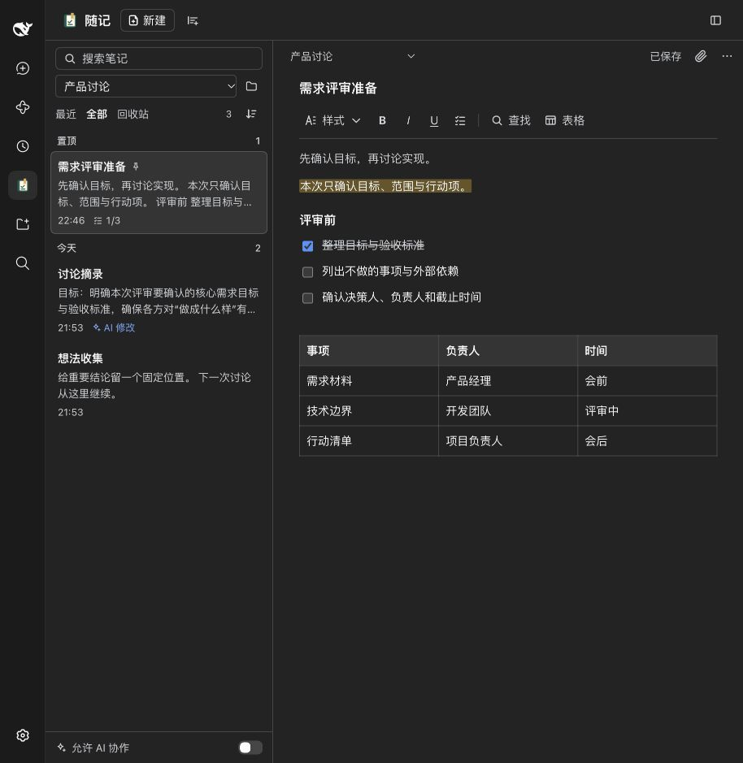
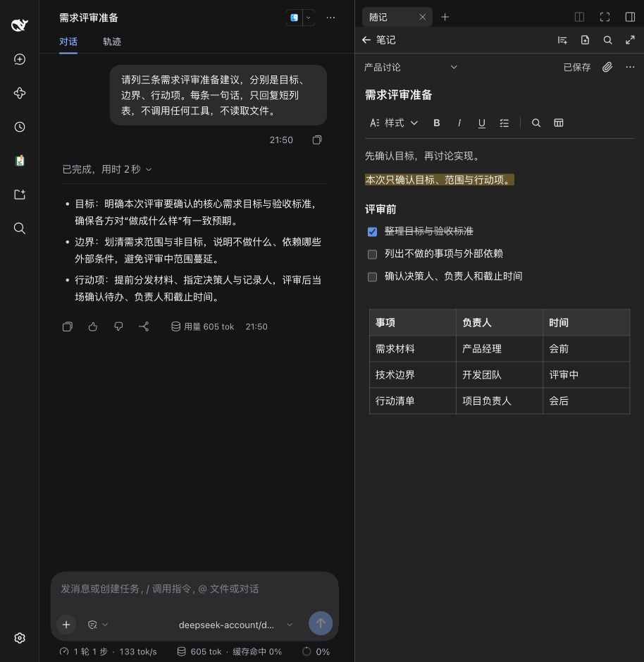

<p align="center">
  
</p>

<h1 align="center">随记 / Jot</h1>

<p align="center">在 DSH 里直接写笔记、待办和轻文档。内容由你掌控，需要时再让 AI 帮忙维护。</p>

<p align="center">
  <a href="https://www.npmjs.com/package/dsh-jot"></a>
  
  <a href="./LICENSE"></a>
</p>

<p align="center">
  中文 · <a href="./README.en.md">English</a> · <a href="./docs/GUIDE.zh-CN.md">使用指南</a> · <a href="./CHANGELOG.md">更新记录</a> · <a href="./docs/VALIDATION.md">验证记录</a>
</p>



*完整页用来浏览和整理，右侧栏用来边聊边记。截图为真实宿主中的示例笔记。*

## 为什么用随记

- **你来写，AI 来帮。** 普通文档编辑，不用写 Markdown；AI 协作默认关闭，打开后它也只在你要求时读写笔记。
- **就在对话旁边。** 左侧导航打开完整工作台；对话时在右侧栏打开，一边聊一边记。
- **数据在本机。** 笔记默认保存在 DSH 数据目录，插件不提供云同步；随时导出为 Markdown、Word、PDF 或 TXT。启用 AI 协作后，Agent 读取的内容会进入当前会话和所选模型的上下文。

## 能做什么

- **写：** 标题、粗体、斜体、下划线、列表、可勾选的待办、引用、代码、表格、文字颜色和高亮。表格可增删行列、拖动列宽。
- **找：** 搜索标题和正文（标题命中优先），在笔记内查找与替换；置顶、最近修改、可选文件夹、排序和多选。列表直接显示清单进度，如 `2/5`。
- **收：** 摘录选中的文字到新笔记或当前笔记；粘贴截图、拖入文件，附件用 DSH 官方查看器预览 Word、表格、PDF、图片和文本。
- **稳：** 自动保存、恢复草稿、版本冲突时保留你的内容；移到回收站可撤销，也可以永久删除并清理它独有的附件。
- **和 AI 一起：** AI 可以用简单 Markdown 写出标题和清单、给清单追加条目、勾选某一项；AI 改过的笔记会标上「AI 修改」，你编辑后标记消失。

## 安装

```sh
# 桌面客户端
dsh plugin --profile desktop add dsh-jot

# DSH Web UI
dsh plugin --profile web add dsh-jot
```

安装后重启对应 Host。Desktop 和 Web 的插件相互独立，需要分别安装；官方桌面应用的菜单「管理 dsh 命令…」可以启用内置 CLI。CLI 需要 Node.js `^22.19.0 || >=24`。

**升级：** `dsh plugin --profile desktop add dsh-jot@latest`，然后重启 Host。**卸载：** `dsh plugin --profile desktop remove dsh-jot`；笔记数据不会随插件删除。Web 把 `desktop` 换成 `web`。

## 三步开始

1. 点击左侧导航的「随记」，按「新建」写下第一条笔记；标题里按 Enter 进入正文。
2. 对话时在右侧栏的新标签页里选择「随记」，把重点记在对话旁边。
3. 想让 AI 帮忙时，打开列表底部的「允许 AI 协作」，再明确告诉它要读或改哪篇笔记。



## 和 AI 一起用

开关打开后，agent 可以使用这些工具；每次调用都会检查开关的最新状态，AI 无法自己打开它。

| 工具 | 用途 |
| --- | --- |
| `jot_list` / `jot_read` | 搜索笔记、读取正文和编号的待办项 |
| `jot_create` | 新建笔记，支持 `#` 标题、`- [ ]` 待办、列表、引用、表格等简单 Markdown |
| `jot_update` | 追加内容（推荐）或改标题；整篇替换会拒绝丢失表格、附件和颜色 |
| `jot_set_task` | 勾选或取消某一个待办项，不动其他内容 |
| `jot_delete` | 移到回收站，你可以恢复 |

可以这样说：「把刚才确认的三件事记到随记『周会』里」「把『会后待办』的第 2 项勾掉」。笔记不会自动进入对话，AI 只在用到工具时读取。

## 快捷键

| 操作 | macOS | Windows / Linux |
| --- | --- | --- |
| 粗体／斜体／下划线 | ⌘B / I / U | Ctrl+B / I / U |
| 撤销／重做 | ⌘Z / ⇧⌘Z | Ctrl+Z / Ctrl+Shift+Z，另支持 Ctrl+Y |
| 当前笔记查找／立即保存 | ⌘F / ⌘S | Ctrl+F / Ctrl+S |
| 搜索笔记库 | `/`（焦点在随记里、不在输入框时） | 同左 |

也可以直接输入：`# ` 标题、`- ` 列表、`1. ` 编号、`[ ] ` 待办、`> ` 引用、`---` 分割线、`**粗体**`。

「随记：打开随记」「随记：新建笔记」「随记：摘录选中的文字」会出现在 DSH 的键盘快捷键设置里，默认不占用任何按键，可以按自己的习惯绑定。

## 数据

笔记保存在 `$DSH_HOME/jot`（未设置时为 `~/.dsh/jot`），备份时保留整个目录；使用同一个数据目录的 Desktop 与 Web 共用这份数据。恢复草稿另存于界面的 Local Storage。附件默认单个 20 MiB、合计 500 MiB。人和 AI 的每次修改都会检查版本，不会静默覆盖。

## 兼容性

| 环境 | 状态 |
| --- | --- |
| DSH 0.2.0-rc.2 · 官方 macOS Desktop | 当前桌面发行版；实机验收结果见[验证记录](./docs/VALIDATION.md) |
| DSH 0.2.1-alpha.1 · Web | 三条可绑定命令、深色与表格控件已在真实宿主中验收；alpha 为预发布版本 |
| Windows / Linux | CI 通过源码检查；界面与快捷键尚未实机验收 |
| 云同步、多人实时编辑、历史版本、绘图 | 暂不提供 |

## 常见问题

**和直接让 AI「记住」有什么区别？** 随记里的内容是你能看到、编辑和导出的文档，不会被悄悄改写或注入每轮对话；AI 只在你打开开关并提出要求时才读写。

**卸载或升级会丢笔记吗？** 不会。笔记在 DSH 数据目录里，与插件包分开存放。旧版本也能继续读取新版本保存的笔记。

**为什么某些操作提示「还有保留的草稿」？** 另一个面板里有未保存的修改。打开那篇笔记，载入最新版本或另存为新笔记后再继续，这样不会丢失任何一边的内容。

## 了解更多

- [使用指南](./docs/GUIDE.zh-CN.md)：附件与导出限制、AI 工具细节、数据备份和冲突处理。
- [功能清单](./PRODUCT.md)：产品约定、已实现功能和后续方向。
- [GitHub Releases](https://github.com/Totoro-qaq/dsh-jot/releases) · [npm](https://www.npmjs.com/package/dsh-jot) · [反馈问题](https://github.com/Totoro-qaq/dsh-jot/issues)

<details>
<summary>从源码构建</summary>

准备 Node.js `^22.19.0 || >=24` 和 pnpm 11：

```sh
git clone https://github.com/Totoro-qaq/dsh-jot.git
cd dsh-jot
pnpm install --frozen-lockfile
pnpm check            # 类型检查、测试和构建
pnpm dev              # 本地预览：http://127.0.0.1:4178
pnpm pack --pack-destination artifacts
dsh plugin --profile desktop add "$PWD/artifacts/dsh-jot-<版本>.tgz"
```

Web 使用 `--profile web`。修改 `src/client/icons.tsx` 后运行 `pnpm icons` 同步 `assets/icons`。

</details>

[MIT](./LICENSE) · PDF 内嵌字体使用 [SIL Open Font License](./assets/fonts/OFL.txt)。
